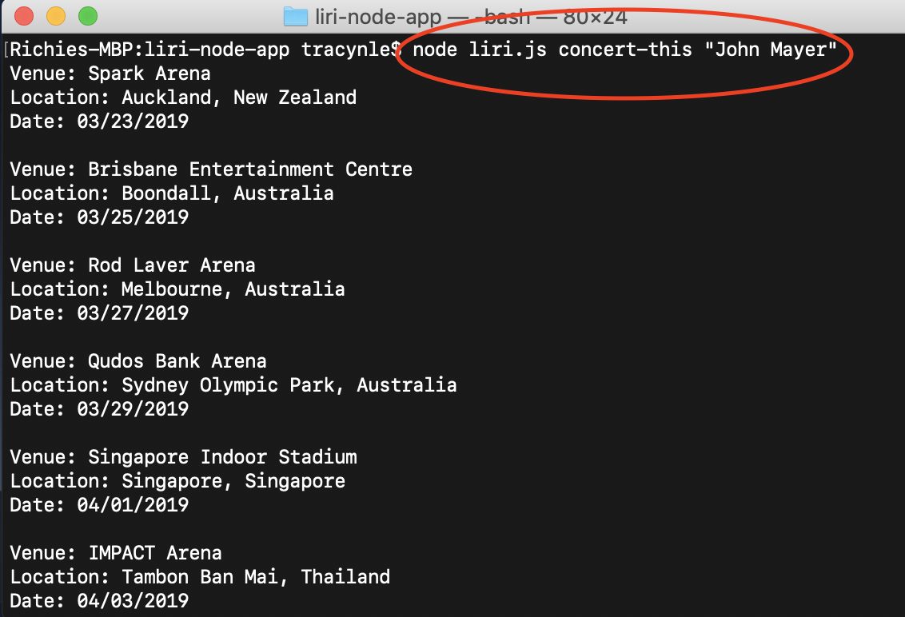
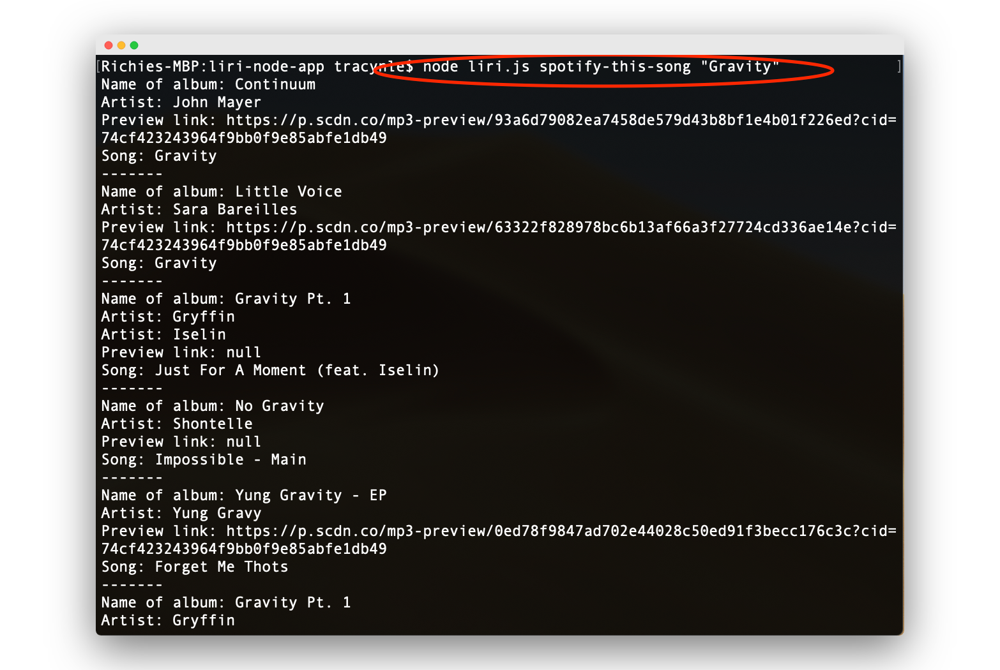
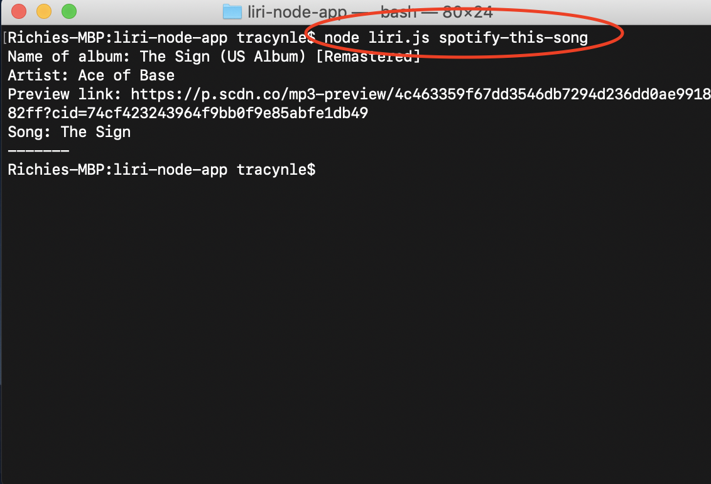
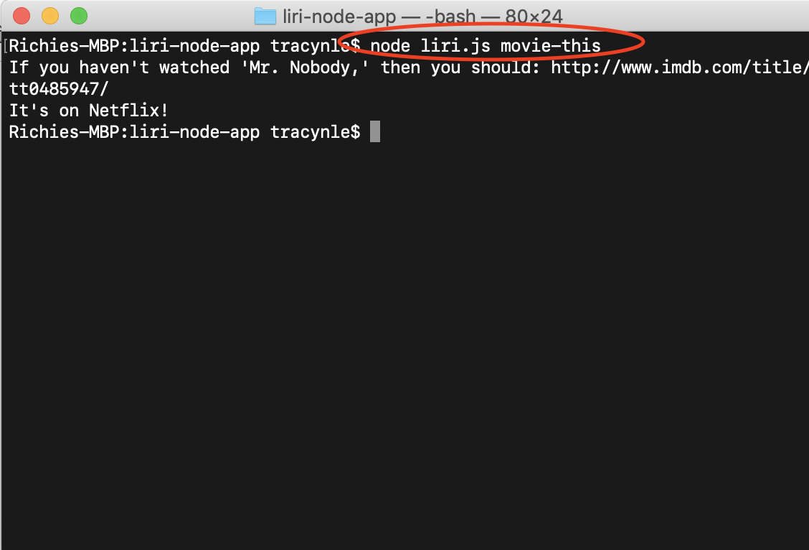
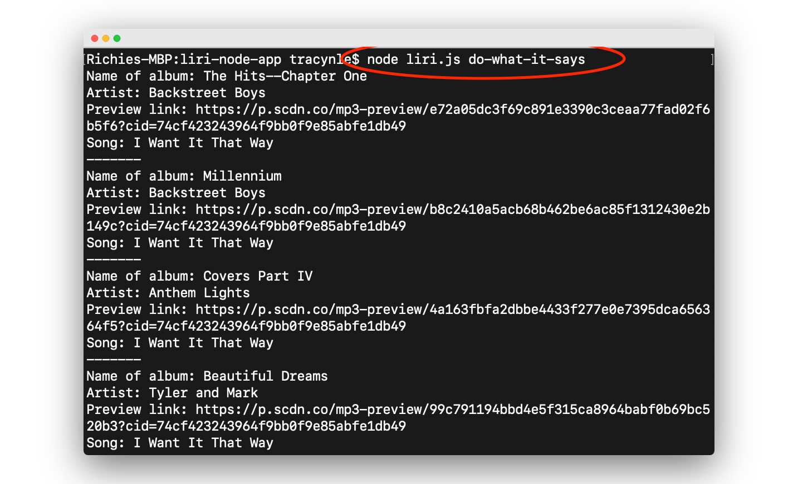

# liri-node-app
Liri-node-app functions like Apple's SIRI, Speech Interpretation and Recognition Interface but LIRI is a *Language* Interpretation and Recognition Interface. LIRI will be a command line Node app that takes in parameters and gives you back data that you are searching for.

## What LIRI uses to search for you:
- Spotify for songs
- Bands in Town for concerts (with Axios)
- OMDB for movies  (with Axios)

## Instructions 
Open your Terminal and you can begin your song, concert, or movie searches. Each command requires different parameters, so be sure to include these in your search. 

### If the artist/band name or move titles are longer than one word, include them in quotation marks:
`"movie or song or artist/band name"`

### Bands in Town for concerts
`node lirir.js concert-this <artist/band name here> `

The search will show you something like this:

### Spotify for songs
`node lirir.js spotify-this-song <song name here> `

The search will show you something like this:

If you do not put anything in the past argument, then your search will default to another search, recommending you something else like this:

### OMDB for movies 
`node lirir.js movie-this <movie title here> `

The search will show you something like this:

### Do-what-it-says
The last command will run a text file that will search a song that is already saved. Try out this command and see what will search up! 

`node liri.js do-what-it-says`

