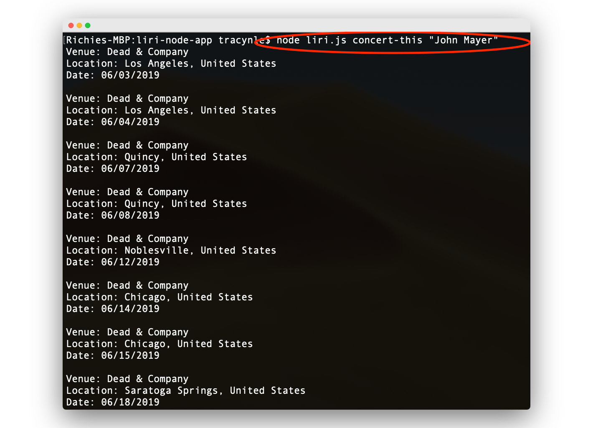
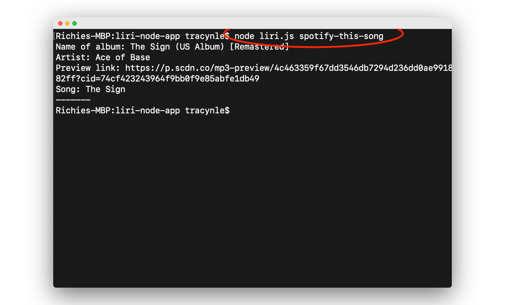
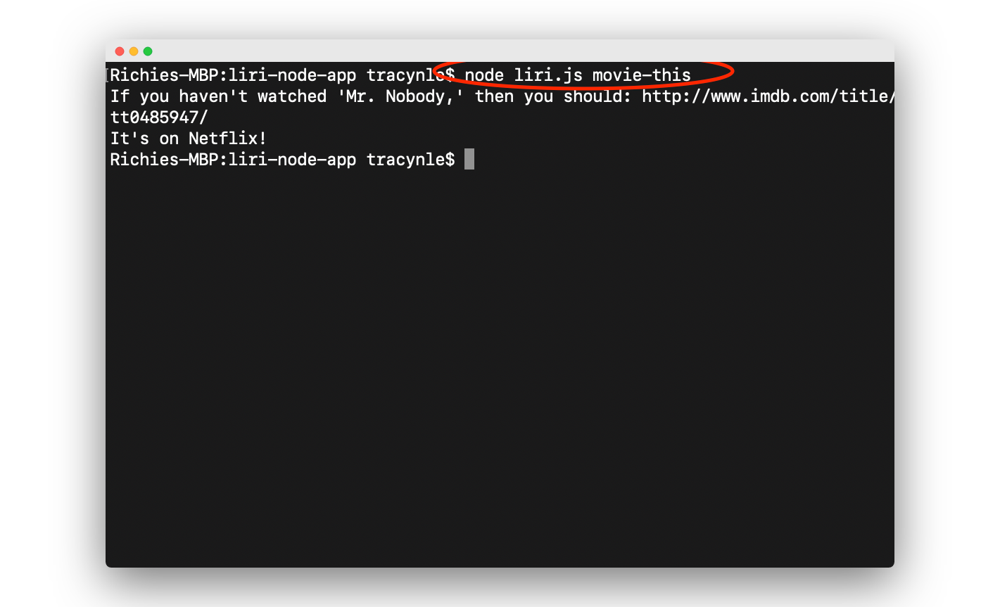

# liri-node-app
Liri-node-app functions like Apple's SIRI (Speech Interpretation and Recognition Interface) but LIRI is a *Language* Interpretation and Recognition Interface. LIRI will be a command line Node app that takes in a few parameters and gives you back data you are searching for.

## What LIRI uses to search for you:
- Spotify for songs
- Bands in Town for concerts (with Axios)
- OMDB for movies  (with Axios)

The purpose of this Liri Node App is to search up information at your disposal from just using your terminal without having to go to your web browser! 

## Instructions 
First, open your Terminal and you can begin your song, concert, or movie searches. Each command requires different parameters, so be sure to include these in your searches. 

### Parameters
If the artist/band name or movie titles are longer than one word, include them in quotation marks like this: 

`"<movie or song or artist/band name"`

Further examples:

`"The Greatest Showman"`

`"The Killers"`

## Bands in Town for concerts
To search for concerts, use `concert-this`

`node liri.js concert-this <artist/band name here> `

## Spotify for songs
To search for songs, use `spotify-this-song`

`node liri.js spotify-this-song <song name here> `

If you do not put anything in the last argument, then your search will default to another search recommending you something else:

## OMDB for movies 
To search for movies, use `movie-this` 

`node liri.js movie-this <movie title here> `

## Do-what-it-says
The last command will run a text file that will search a song that is already saved. Try out this command and see what will search up! 

`node liri.js do-what-it-says`

